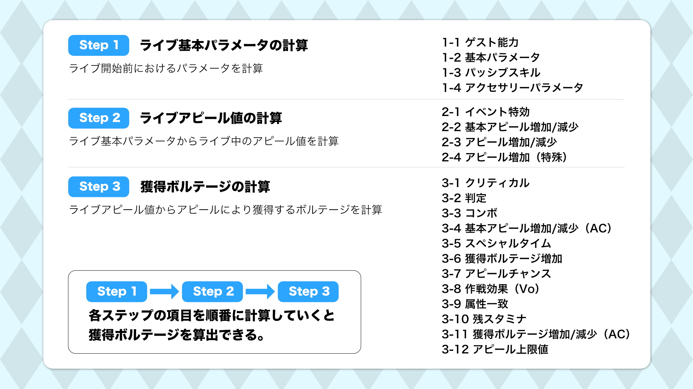

# 概要

本章では、ライブ中にスクールアイドルがアピールしたときに獲得できるボルテージの計算方法を記載します。アピールの獲得ボルテージは、次の3ステップにより計算できます。

1. **ライブ基本パラメータの計算**
2. **ライブパラメータの計算**
3. **獲得ボルテージの計算**

まず、ライブ開始前のパラメータ（アピール・スタミナ・テクニック）である、ライブ基本パラメータを計算します。次に、ライブ基本パラメータのアピール値（ライブ基本アピール値）に対して、ライブ中に発動する効果を適用したライブアピール値を計算します。最後に、ライブアピール値をもとに獲得ボルテージを計算します。

本章では、獲得ボルテージの計算順序に合わせて、ライブ基本パラメータの計算、ライブアピール値の計算、獲得ボルテージの計算の順に、各ステップの計算を記載していきます。

