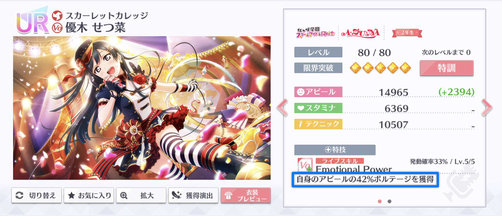

# ライブアピール値の計算

ライブアピール値は、ライブ中におけるカードのアピール値を指します。ライブ基本パラメータのアピール値（ライブ基本アピール値）が、ライブ中に発動する効果により増減した結果がライブアピール値です。

ライブアピール値は、ライブ基本アピール値に対して、次の項目を順に乗算していくことで計算できます。

1. **イベント特効**
2. **基本アピール増加/減少**
3. **アピール増加/減少**
4. **アピール増加（特殊）**

ライブアピール値は、アピールの獲得ボルテージのほか、アピール値を参照する特技・個性の効果量やSP特技の獲得ボルテージを決定する際に使用されます。例えば、画像のせつ菜の特技のように、効果量が「自身のアピールの〜％」と記載されている場合、ライブアピール値を参照して効果量が決まります。


スタミナ又はテクニックを参照する特技・個性の効果量も同様に、ライブ中に増減したスタミナ値・テクニック値（ライブスタミナ値・ライブテクニック値）を参照して決定されます。現在、ライブ中にスタミナ値・テクニック値を増減させる効果はイベント特効のみです。イベント特効を適用したライブスタミナ値・ライブテクニック値の計算方法は、「イベント特効」を参照下さい。




