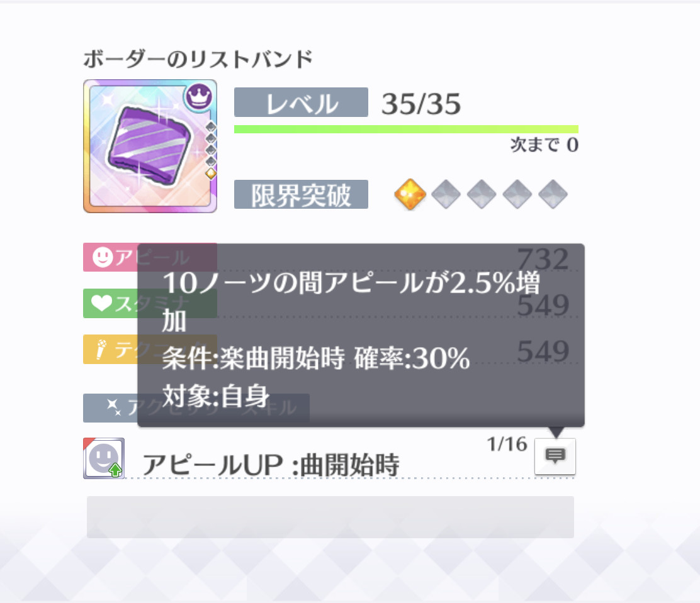
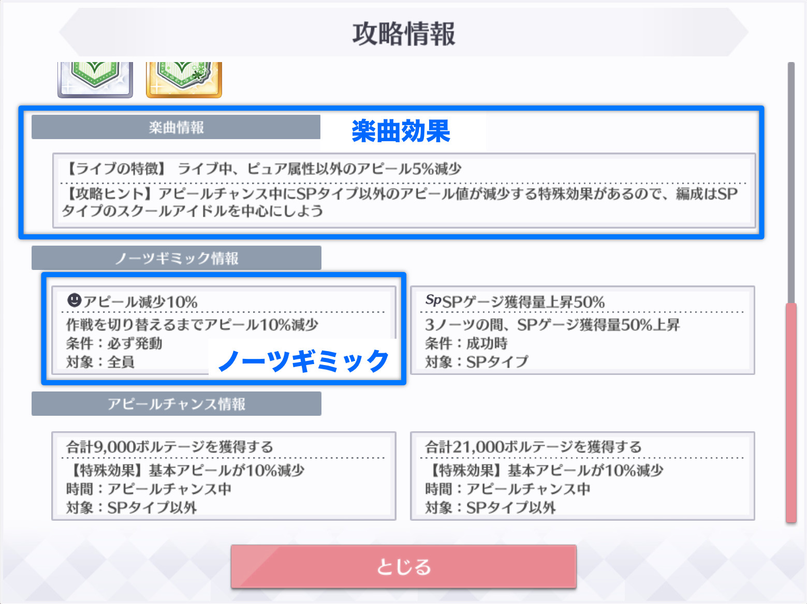
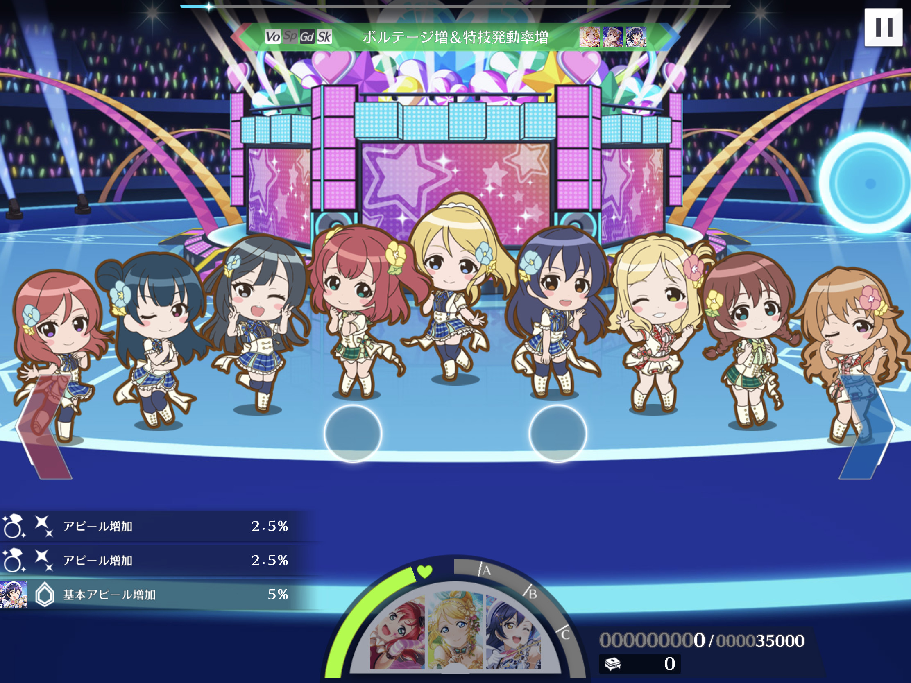
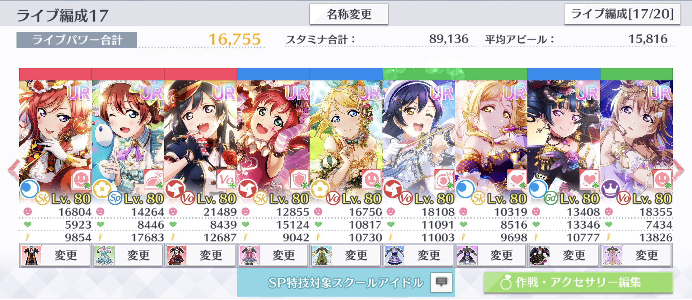

# アピール増加/減少

アピール増加/減少は、基本アピール増加/減少を適用した後のアピール値を増減させる効果です。アピール増加/減少には次の種類があります。

* スクールアイドルのライブスキル（特技・個性2・ひらめきスキル）
* リストバンドのライブスキル
* 楽曲効果
* ノーツギミック

### スクールアイドルのライブスキル

スクールアイドルがもつアピール増加/減少のライブスキルには、特技、個性2及びひらめきスキルがあります。スクールアイドル詳細画面に「ライブスキル」と表示されるもののうち、効果が「アピールを〜%増加」であるものが該当します。

### リストバンドのアクセサリースキル

リストバンドのアクセサリースキルもアピール増加の一つです。

### 楽曲効果・ノーツギミック

ライブの攻略情報から確認できる「楽曲情報」及び「ノーツギミック情報」に記載された効果もアピールを増加/減少させます。「アピール〜％増加/減少」と記載されているものが該当します。

## アピール増加/減少の効果時間

アピール増加/減少の効果は、「〜ノーツ間」のように効果時間が決まっています。楽曲効果のみライブ終了まで発動しますが、基本アピール増加/減少と異なり、減少/低下効果解除のスキルによって減少効果を解除することができます。

## アピール増加/減少の効果対象

基本アピール増加/減少の効果対象と同様の効果対象となります。

## アピール増加/減少によるアピール値の変動の計算

アピール増加/減少によって変動したアピール値は、次のルールで計算されます（基本アピール増加/減少と同じ方法で計算できます）。

1. 同一スクールアイドルを対象とするアピール増加/減少の効果量を合計する。
2. 1.で求めたアピール増加/減少の合計効果量を、基本アピール増加/減少を適用したアピール値に乗算する。
3. 2.を基本アピール増加/減少を適用したアピール値に加算する。
4. 3.の計算結果の小数点以下を切り捨てて整数にする。

計算を数式で表すと、次のとおりとなります。

$$
a_{\text{ap}} = \left\lfloor \left( 1+\sum_{x \in \mathbb{X}_{\text{ap}}} \frac{x}{100} \right) a_{\text{ba}}\right\rfloor
$$

ここで、数式内の変数及び記号の意味はそれぞれ次のとおりです。

$$
\begin{align}
  a_{\text{ap}} & = \text{アピール増加/減少を適用したアピール値} \\
  a_{\text{ba}} & = \text{基本アピール増加/減少を適用したアピール値}\\
  \mathbb{X}_{\text{ap}} & = \text{適用されるアピール増加/減少の効果量（%表示）の集合}\\
  \lfloor\cdot\rfloor & = \text{小数点以下の切り捨て}
\end{align}
$$

## リストバンドのアクセサリースキルの発動判定

リストバンドのアクセサリースキルは、作戦内のスクールアイドルそれぞれに対して個別に発動判定されます。

上の画像では、リストバンドのアクセサリースキルが2回発動していますが、編成に設定したリストバンドは一つです。これは、リストバンドのアクセサリースキルが、同作戦内の2枚のカードに対して発動成功したことを示しています（つまり、残り1枚のカードは、リストバンドのアクセサリースキルの効果を得られていません）。リストバンドのアクセサリースキルがどのカードに対して発動成功したのかは、ログから確認することができません。


アクセサリーパラメータの計算時と同様に、一つのアクセサリーが3個セットで、作戦内のスクールアイドル全員に装着されると考えると、リストバンドのアクセサリースキルがスクールアイドルごとに発動判定されることに納得できます。




## 計算の例

画像の編成内のエマに、アピール増加/減少の効果を適用します。

この例では、ゲストなしでユメノトビラの初級をプレイします。ゲストなしなので、エマのライブ基本アピール値は、編成画面のアピール値と同じ14264となります。

### イベント特効

通常ライブのため、イベント特効は適用されません。よって、イベント特効を適用したアピール値は、ライブ基本アピール値と等しくなります。

$$
a_{\text{ev}} = a_{\text{lb}}
$$

### 基本アピール増加/減少

基本アピール増加/減少の効果を適用します。発動した基本アピール増加/減少の効果は次のとおりです。

* 海未の個性2（基本アピール増加5%）

エマに適用される基本アピール増加/減少の効果は+5%となります。よって、基本アピール増加/減少の効果を適用したエマのアピール値は、次のとおり14977となります。

$$
\begin{align} 
\left\lfloor \left( 1+\sum_{x \in \mathbb{X}_{\text{ba}}} \frac{x}{100} \right) a_{\text{lb}}\right\rfloor & = \left\lfloor  (1+0.05)\times 14264\right\rfloor \\
 & = \lfloor 14977.2\rfloor \\
  & = 14977
\end{align}
$$

### アピール増加/減少

アピール増加/減少の効果を適用します。発動したアピール増加/減少の効果は次のとおりです。

* 真姫の特技（アピール増加 5.9%）
* 善子のひらめきスキル（アピール増加 1%）
* URリストバンド（スキルレベル1）のライブスキル（アピール増加 2.5%）
* ユメノトビラの楽曲効果（アピール減少 5%）
* ユメノトビラのノーツギミック（アピール減少 10%）

エマに適用されるアピール増加/減少の効果量は、合計で-5.6%となります。

$$
\begin{align}
\sum_{x \in \mathbb{X}_{\text{ap}}}\frac{x}{100} &= \frac{5.9+1+2.5-5-10}{100} \\
 &= -0.056
\end{align}
$$

基本アピール増加/減少の効果を適用したエマのアピール値（14977）を、アピール増加/減少の効果により5.6%減少させます。この時点でのエマのアピール値は14138.288です。

$$
\begin{align} 
\left( 1+\sum_{x \in \mathbb{X}_{\text{ap}}} \frac{x}{100} \right) a_{\text{ba}} & = (1-0.056)\times 14977 \\
 & = 14138.288
\end{align}
$$

最後に、計算結果の小数点以下を切り捨てて、アピール増加/減少の効果を適用したエマのアピール値は、14138となります。

$$
\begin{align} 
a_{\text{ap}} = \left\lfloor \left( 1+\sum_{x \in \mathbb{X}_{\text{ap}}} \frac{x}{100} \right) a_{\text{ba}}\right\rfloor & = \lfloor 14138.288 \rfloor \\
 & = 14138
\end{align}
$$

エマがアピールしたときの獲得ボルテージが、計算結果と一致しました。


今回の例では、アピール増加/減少を適用したアピール値がそのまま獲得ボルテージになるように、後の計算要素を全て排除しています。


