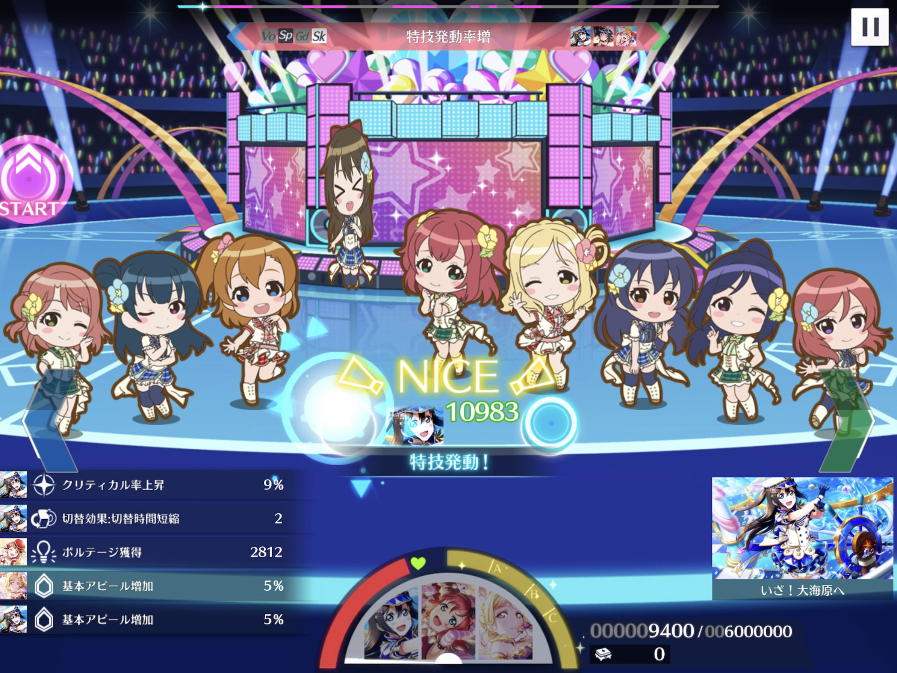

# 基本アピール増加/減少

基本アピール増加/減少は、イベント特効を適用した後のアピール値を増減させる効果です。特効がないライブでは、ライブ基本アピール値を増減させる最初の効果となります。基本アピール増加/減少には次の種類があります。

* スクールアイドルのライブスキル（個性2・ひらめきスキル）
* ブローチのアクセサリースキル
* 楽曲効果

### スクールアイドルのライブスキル

スクールアイドルがもつ基本アピール増加/減少のライブスキルには、個性2及びひらめきスキルがあります。スクールアイドル詳細画面に「ライブスキル」と表示されるもののうち、効果が「基本アピールを〜%増加」であるものが該当します。


ライブスキルは、パッシブスキルと対になるスキルです。パッシブスキルがライブ前に効果を適用するのに対して、ライブスキルはライブ中に効果を発動します。


### ブローチのアクセサリースキル

ブローチのアクセサリースキル「アピール+（元気）」も基本アピールを増加させる効果の一つです。

### 楽曲効果

ライブの攻略情報から確認できる「楽曲情報」に記載された効果も基本アピールを増加/減少させます。【ライブの特徴】に記載される効果のうち「基本アピール〜％増加/減少」のものが該当します。


アピールチャンスの効果にも基本アピール増加/減少がありますが、これは異なる影響を及ぼす別物なので、基本アピール増加/減少の計算対象外となります。アピールチャンスの基本アピール増加/減少は、獲得ボルテージを計算する際に扱います。


## 基本アピール増加/減少の効果時間

基本アピール増加/減少の効果は、一度発動すると、ライブ終了まで発動し続けます。途中で効果が終了したり、効果が解除されたりすることはありません。


基本アピール増加/減少のような「基本」とついた効果は、効果時間の指定がなく、ライブ終了まで発動し続けます。一方で、アピール増加/減少のように「基本」がついていない効果は「〜ノーツ間」のように効果時間が決まっていたり、発動中に効果が解除されたりします。


## 基本アピール増加/減少の効果対象

パッシブスキルと同様の効果対象となります。


ブローチのアクセサリースキルの効果対象「自身」は、アクセサリーパラメータの計算時と同様に、一つのアクセサリーが3個セットだと考えて適用先を決めます。作戦に一つブローチを設定すると、作戦内の各スクールアイドルにブローチが装着され、装着しているスクールアイドル自身に対してブローチのアクセサリースキルが発動します。結果、作戦に一つブローチを設定すると、作戦内の全スクールアイドルに対してブローチのアクセサリースキルが発動します。




## 基本アピール増加/減少によるアピール値の増減の計算

基本アピール増加/減少によって変動したアピール値は、次のルールで計算されます（パッシブスキルと同じ方法で計算できます）。

1. 同一スクールアイドルを対象とする基本アピール増加/減少の効果量を合計する。
2. 1.で求めた基本アピール増加/減少の合計効果量をイベント特効を適用したアピール値に乗算する。
3. 2.をイベント特効を適用したアピール値に加算する。
4. 3.の計算結果の小数点以下を切り捨てて整数にする。

計算を数式で表すと、次のとおりとなります。

$$
a_{\text{ba}} = \left\lfloor \left( 1+\sum_{x \in \mathbb{X}_{\text{ba}}} \frac{x}{100} \right) a_{\text{ev}}\right\rfloor
$$

ここで、数式内の変数及び記号の意味はそれぞれ次のとおりです。

$$
\begin{align}
  a_{\text{ba}} & = \text{基本アピール増加/減少を適用したアピール値} \\
  a_{\text{ev}} & = \text{イベント特効を適用したアピール値}\\
  \mathbb{X}_{\text{ba}} & = \text{適用される基本アピール増加/減少の効果量（%表示）の集合}\\
  \lfloor\cdot\rfloor & = \text{小数点以下の切り捨て}
\end{align}
$$

## ブローチのアクセサリースキルの効果量

ブローチのアクセサリースキルの効果量は、ライブ中の残スタミナ量及びスキルレベルにより変動します。これにより、ライブ中に発動しているブローチのスキル効果量は、ゲーム内の画面から確認することが困難となっています。

### 残スタミナ量に応じた効果量の変動

アクセサリー情報画面から見られるブローチのアクセサリースキルの効果量は、残スタミナが100%のときの効果量です。ブローチのライブスキルの効果量は、残スタミナ量と正比例の関係にあり、スタミナの減少割合と同じだけ、効果量が減少していきます。例えば、ライブ中にスタミナが80%まで減った場合、ブローチの効果量も80%まで減少します。

### アクセサリーレベルに応じた効果量の変動


本項には推測が含まれます。


アクセサリー情報画面から見られるライブスキルの効果量は小数第1位までしか表示されませんが、内部的には小数第2位以下の値をもっています。実際の効果量は、同レアリティのスキルレベルMAXの効果量を基準として、次のように決まっています。

* スキルレベル1の効果量: スキルレベルMAXの効果量の半分**［推測］**
* スキルレベルアップによる効果量の上昇量: スキルレベルMAXまで同量

例えばRのブローチは、スキルレベルのMAXが10で効果量が2.5%です。よって、スキルレベル1の効果量は半分の1.25%で、スキルレベルが1上がるごとに効果量が $$\frac{1.25}{9}$$ %ずつ上昇していきます。

## パッシブスキルのアピール+との違い

ゲーム上では、基本アピール増加/減少の効果は「基本アピールが〜%増加/減少」と記載されており、前章で扱ったパッシブスキルのアピール+と説明文が同じです。説明文では両者の違いが分かりづらいのですが、次のような違いがあり、使い分けができます。

**アピール+（パッシブスキル）**

* 基本アピール値を上昇させる
* 常に発動する

**基本アピール増加/減少（ライブスキル・楽曲効果）**

* ライブ基本アピール値を上昇させる
* ライブ中に発動条件を満たしたとき、一定確率で発動する

基本アピール増加/減少は、アクセサリーのパラメータが加算されたライブ基本アピール値を上昇させるため、同じ効果量のパッシブスキルよりも、アピール値を大きく引き上げることができます。一方で、常に発動するパッシブスキルと異なり、基本アピール増加/減少は効果が発動しない可能性があります。

## 計算の例

画像の編成内のしずくに、基本アピール増加/減少の効果を適用します。

この例では、ゲストなしで「スリリング・ワンウェイ」の上級をプレイします。

### ライブ基本アピール値の計算

ゲストなしなので、しずくのライブ基本アピール値は、編成画面のアピール値と同じ11411となります。

### イベント特効

通常ライブのため、イベント特効は適用されません。よって、イベント特効を適用したアピール値は、ライブ基本アピール値と等しくなります。

$$
a_{\text{ev}} = a_{\text{lb}}
$$

### 基本アピール増加/減少

次の基本アピール増加/減少の効果が適用された状態で、1ノーツ目（スタミナ100%時）にしずくがアピールします。

* しずくの個性2（基本アピール増加5%）
* 鞠莉の個性2（基本アピール増加5%）
* URブローチ（スキルレベルMAX）の効果（基本アピール増加5.000%）
* Rブローチ（スキルレベル1）の効果（基本アピール増加1.250%）
* スリリング・ワンウェイの楽曲効果（基本アピール減少20%）

しずくに適用される基本アピール増加/減少の効果量は、合計で-3.75%となります。

$$
\begin{align}
\sum_{x \in \mathbb{X}_{\text{ba}}}\frac{x}{100} &= \frac{5+5+5+1.25-20}{100} \\
 &= -0.0375
\end{align}
$$

基本アピール増加/減少の効果により、しずくのライブ基本アピール値を3.75%減少させます。この時点でのしずくのアピール値は10983.0875です。

$$
\begin{align} 
\left( 1+\sum_{x \in \mathbb{X}_{\text{ba}}} \frac{x}{100} \right) a_{\text{lb}} & = (1-0.0375)\times 11411 \\
 & = 10983.0875
\end{align}
$$

最後に、計算結果の小数点以下を切り捨てて、基本アピール増加/減少の効果を適用したしずくのアピール値は10983となります。

$$
\begin{align} 
a_{\text{ba}} = \left\lfloor \left( 1+\sum_{x \in \mathbb{X}_{\text{ba}}} \frac{x}{100} \right) a_{\text{lb}}\right\rfloor & = \lfloor 10983.0875 \rfloor \\
 & = 10983
\end{align}
$$

しずくがアピールしたときの獲得ボルテージが、計算結果と一致しました。


今回の例では、基本アピール増加/減少を適用したアピール値がそのまま獲得ボルテージになるように、後の計算要素を全て排除しています。


