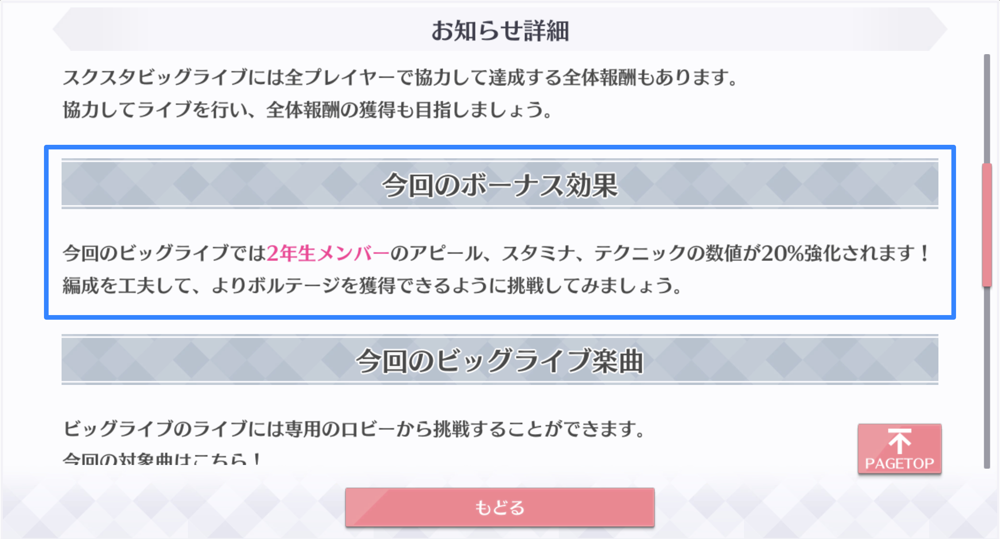

# イベント特効

スクスタビッグライブでは、イベント内のライブで一部スクールアイドルのパラメータが上昇します。

イベント特効の対象及び効果量はお知らせに記載されています。

## イベント特効によるパラメータの増減の計算

イベント特効によって変動したパラメータは、次のルールで計算されます。

1. イベント特効の効果量をライブ基本パラメータに乗算する。
2. 1.の計算結果をライブ基本パラメータに加算する。

計算を数式で表すと、次のとおりとなります（簡単のためアピール値のみ計算します）。

$$
a_{\text{ev}} = \left\lfloor \left( 1+ \frac{c_{\text{ev}}}{100} \right) a_{\text{lb}}\right\rfloor
$$

ここで、数式内の変数及び記号の意味はそれぞれ次のとおりです。

$$
\begin{align}
  a_{\text{ev}} & = \text{イベント特効を適用したアピール値} \\
  a_{\text{lb}} & = \text{ライブ基本アピール値}\\
  c_{\text{ev}} &= イベント特効の効果量（\%）\\
  \lfloor\cdot\rfloor & = \text{小数点以下の切り捨て}
\end{align}
$$


スタミナ及びテクニックをライブ中に変動させる効果は、イベント特効のみです。よって、ライブ基本スタミナ値及びライブ基本テクニック値にイベント特効を適用した結果が、ライブスタミナ値及びライブテクニック値となります。以降の計算項目は全てアピールを変動させるものとなります。


