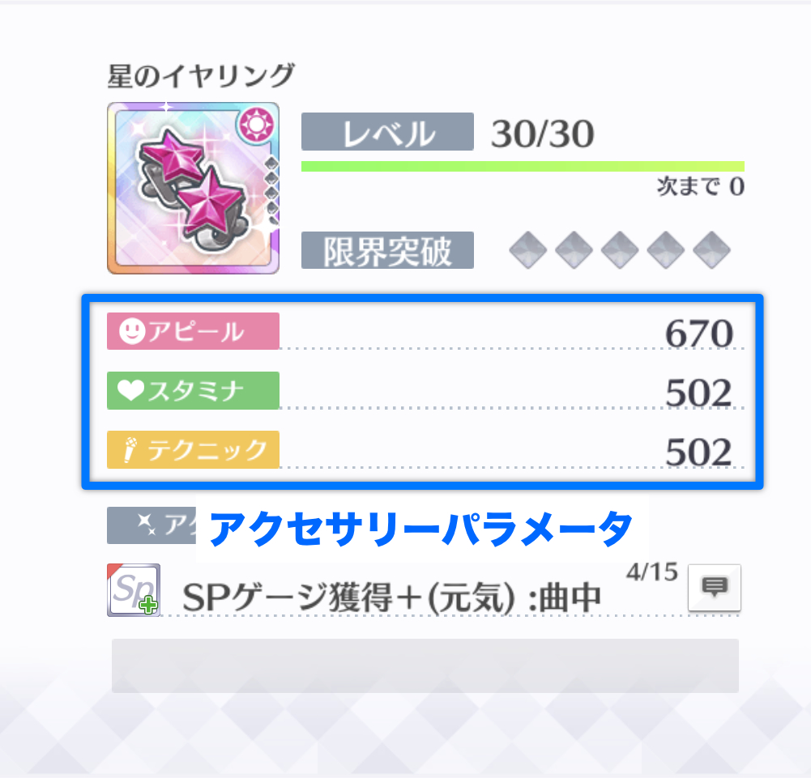

# アクセサリーパラメータ

パッシブスキルにより上昇した基本パラメータに、作戦に設定されたアクセサリーのパラメータを加算することで、ライブ基本パラメータを算出できます。

アクセサリーパラメータは、ゲーム内の「アクセサリー一覧」から「アクセサリー詳細画面」を開くことで確認できます。

## アクセサリーの装着

**アクセサリーは3個セットです。**作戦にアクセサリーを設定すると、3個セットのアクセサリーが、作戦内のスクールアイドルに1個ずつ装着された状態となります。アクセサリーは各作戦に3つまで設定できるため、編成内のスクールアイドルは、最大で3個のアクセサリーを装着できます。

アクセサリーを装着したスクールアイドルは、パッシブスキルを適用したパラメータに、装着したアクセサリーのパラメータが加算された状態でライブに参加できます。

## アクセサリーパラメータの属性一致補正

アクセサリーパラメータの加算時に、加算対象のスクールアイドルの属性とアクセサリーの属性が一致している場合、次のルールでアクセサリーパラメータが属性一致補正されます。

1. アクセサリーパラメータを1.1倍する。
2. 1.の小数点以下を切り捨てて整数にする。

## アクセサリーパラメータによるパラメータ上昇の計算

アクセサリーパラメータによって上昇したパラメータは、次のルールで計算されます。

1. パラメータ計算対象のスクールアイドルと同作戦内のアクセサリーを一つ選択する。
2. 1.で選択したアクセサリーが、計算対象のスクールアイドルと属性一致する場合、アクセサリーパラメータを属性一致補正する。
3. 2.で求めたアクセサリーパラメータを、計算対象のスクールアイドルのパッシブスキルを適用したパラメータに加算する。
4. 1.〜3.を、計算対象のスクールアイドルと同作戦内の全てのアクセサリーについて計算する。

計算を数式で表すと、次のとおりとなります（簡単のため、アピール値の計算のみ示します）。

$$
a_{\text{lb}} = a_{\text{ps}}+\sum_{i=1}^{3} \left\lfloor c_{\text{ac}}^{i}a_{\text{ac}}^{i}\right\rfloor
$$

$$
c_{\text{ac}}^{i} = 
\begin{cases}
  1.1 & (\text{属性一致時})\\
  1 & (\text{属性不一致時})
\end{cases}
$$

ここで、数式内の変数及び記号の意味はそれぞれ次のとおりです。

$$
\begin{align}
  a_{\text{lb}} & = \text{ライブ基本アピール値} \\
  a_{\text{ps}} & = \text{パッシブスキルを適用した基本アピール値}\\
  c_{\text{ac}}^{i} & = \text{作戦内のi番目のアクセサリーの属性一致補正}\\
  a_{\text{ac}}^{i} & = \text{作戦内のi番目のアクセサリーのアピール値}\\
  \lfloor\cdot\rfloor & = \text{小数点以下の切り捨て}
\end{align}
$$

## 計算の例

前項でパッシブスキルの効果を適用したルビィに、アクセサリーを装着したときのライブ基本アピール値を計算します。パッシブスキル適用後のルビィのアピール値は11013でした。

ルビィがいる赤作戦に、画像のようにアクセサリーを装着します。

装着したアクセサリーのアピール値は、それぞれ次のとおりです。

* ブレスレット（アクティブ）: 312
* リボン（スマイル）: 855
* キーホルダー（ピュア）: 670

ここで、ブレスレットはルビィと属性が一致するため、属性一致補正によりアピール値が1.1倍され、小数点以下が切り捨てられることに注意して下さい。以上より、ルビィのライブ基本アピール値は次のとおり計算できます。

$$
\begin{align}
  a_{\text{lb}} &= a_{\text{ps}}+\sum_{i=1}^{3} \left\lfloor c_{\text{ac}}^{i}a_{\text{ac}}^{i}\right\rfloor \\
 &= 11013 + \lfloor 1.1\times 312\rfloor + \lfloor 1 \times 855\rfloor + \lfloor 1 \times 670 \rfloor \\
& = 11013 + 343 + 855 + 670\\
& = 12881
\end{align}
$$

ゲスト未使用のため、計算結果が編成画面のパラメータと一致しました。

