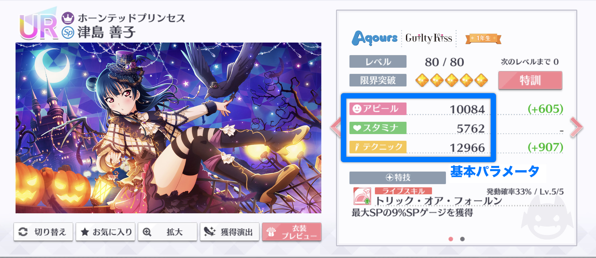

# 基本パラメータ

基本パラメータは、ゲーム内の「スクールアイドル一覧」から「スクールアイドル詳細」画面を開いて確認できるパラメータです。基本パラメータをもとに、ライブ基本パラメータを計算していきます。

基本パラメータは、スクールアイドルのキズナLv.を上げることで上昇します。


キズナLv.が1のときの基本パラメータは、トップ画面の「エピソード」からキャラを選択し「スクールアイドル」に進むと確認できます。


