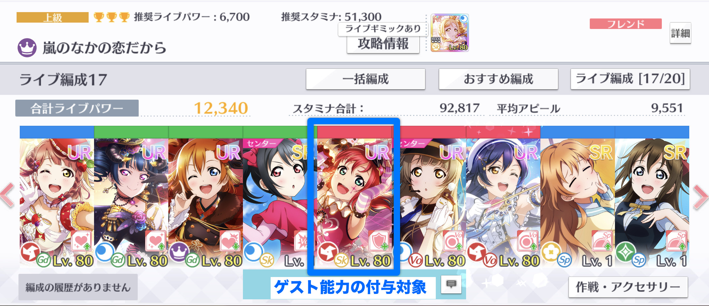

# ゲスト能力

ライブ基本パラメータを計算する前に、ライブ時に選択するゲストの能力を処理する必要があります。

ライブ時にゲストを選択すると、選択したゲストの能力が編成内のスクールアイドルに付与されます。付与されるゲストの能力は次のとおりです。

* 個性
* ひらめきスキル


ひらめきスキルは、選択したゲストがフレンドである場合にのみ付与されます。


ゲスト能力が付与されたスクールアイドルは、ゲストの個性及びひらめきスキルを保有した状態となります。本来、各スクールアイドルは個性を2個まで、ひらめきスキルを4個までしかもてませんが、ゲスト能力が付与されたスクールアイドルは、個性を最大で4個、ひらめきスキルを最大で8個もった状態でライブに参加できます。

## ゲスト能力の付与対象

ゲスト能力は、編成の中央にいるスクールアイドルにのみ付与されます。


編成の中央にいるスクールアイドルが、必ずしもセンターではないことに注意が必要です。「嵐の中の恋だから」など、ダブルセンターであったり、編成の中央以外のメンバーがセンターとなる曲もありますが、このような場合でも、ゲスト能力はセンターではなく編成の中央にいるスクールアイドルに付与されます。


