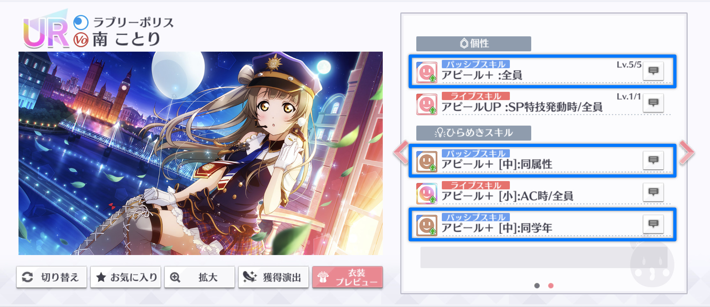
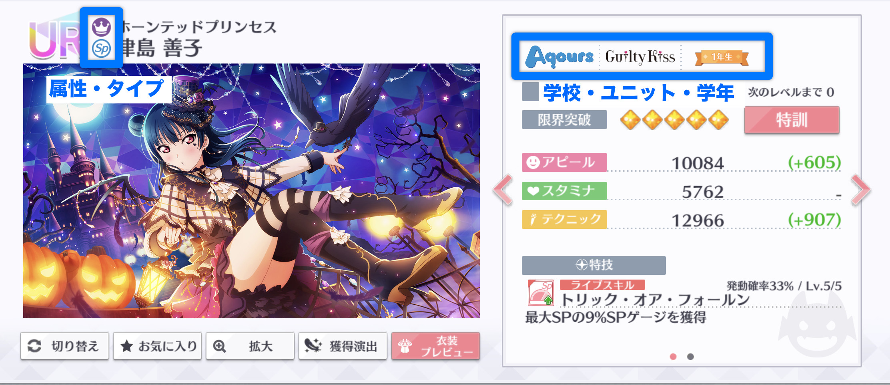
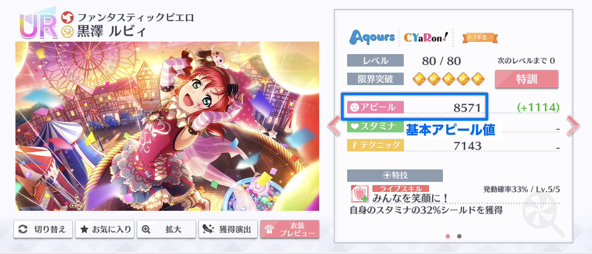

# パッシブスキル

前項で確認した基本パラメータに、スクールアイドルが保有するパッシブスキルの効果を適用します。パッシブスキルは、編成内のスクールアイドルの基本パラメータを上昇させるスキルです。パッシブスキルには次のものがあります。

* 個性1
* ひらめきスキル（パッシブ）

パッシブスキルは、スクールアイドル詳細画面の個性又はひらめきスキルの欄に「パッシブスキル」と表示されます。


本項で計算対象となるパッシブスキルは、ゲストから付与された個性1及びひらめきスキル（パッシブ）を含みます。


## パッシブスキルの種類 

パッシブスキルには次のような種類があります。

| スキル名 | 説明 |
| :--- | :--- |
| アピール+ | 基本パラメータのアピール値（基本アピール値）を上昇させます。 |
| スタミナ+ | 基本パラメータのスタミナ値（基本スタミナ値）を上昇させます。 |
| テクニック+ | 基本パラメータのテクニック値（基本テクニック値）を上昇させます。 |
| クリティカル+ | 基本クリティカル値を上昇させます。 |
| タイプ効果+ | 自身のタイプの作戦効果を上昇させます。 |

なお、クリティカル+及びタイプ効果+は、効果が獲得ボルテージの計算時に適用されるため、ライブ基本パラメータの計算には含めません。

## パッシブスキルの効果対象 

パッシブスキルの効果は、スキルを保有するスクールアイドルが属する編成の一部又は全員を対象に適用されます。 効果対象はスキルによって異なり、次のような種類があります。

| 効果対象 | 説明 |
| :--- | :--- |
| 自身 | パッシブスキルを保有するスクールアイドルにのみ効果が適用されます。 |
| 仲間 | パッシブスキルを保有するスクールアイドル以外に効果が適用されます。 |
| 全員 | 編成内のスクールアイドル全員に効果が適用されます。 |
| 同属性 | パッシブスキルを保有するスクールアイドルと同属性のスクールアイドルに効果が適用されます。 |
| 同タイプ | パッシブスキルを保有するスクールアイドルと同タイプ（Vo・Sp・Gd・Sk）のスクールアイドルに効果が適用されます。 |
| 同作戦 | パッシブスキルを保有するスクールアイドルと同作戦のスクールアイドルに効果が適用されます。 |
| 同学校 | パッシブスキルを保有するスクールアイドルと同学校（μ's・Aqours・ニジガク）のスクールアイドルに効果が適用されます。 |
| ユニット | パッシブスキルを保有するスクールアイドルと同ユニット（Printempsなど）のスクールアイドルに効果が適用されます。 |
| 同学年 | パッシブスキルを保有するスクールアイドルと同学年のスクールアイドルに効果が適用されます。 |

各スクールアイドルの属性・タイプ・学校・ユニット・学年は、スクールアイドル詳細画面で確認できます。


ゲストから付与されたパッシブスキルの効果対象は、付与先カードを参照して決定されます。例えば、ゲストの鞠莉のひらめきスキル「アピール+（同学年）」が善子に付与された場合、効果対象は鞠莉と同じ3年生ではなく、善子と同じ1年生となります。


## パッシブスキルによるパラメータ上昇の計算

パッシブスキルによって上昇したパラメータは、次のルールで計算されます。

1. 同一カードの同一パラメータを対象とするパッシブスキルの効果量を合計する。
2. 1.で求めたパッシブスキルの合計効果量を基本パラメータに乗算する。
3. 2.を基本パラメータに加算する。
4. 3.の計算結果の小数点以下を切り捨てて整数にする。

計算を数式で表すと、次のとおりとなります（簡単のため、アピール値の計算のみ示します）。

$$
a_{\text{ps}} = \left\lfloor \left( 1+\sum_{x \in \mathbb{X}_{\text{ps}}} \frac{x}{100} \right) a_{\text{bs}}\right\rfloor
$$

ここで、数式内の変数及び記号の意味はそれぞれ次のとおりです。

$$
\begin{align}
  a_{\text{ps}} & = \text{パッシブスキルを適用したアピール値} \\
  a_{\text{bs}} & = \text{基本アピール値}\\
  \mathbb{X}_{\text{ps}} & = \text{適用されるパッシブスキルの効果量（%表示）の集合}\\
  \lfloor\cdot\rfloor & = \text{小数点以下の切り捨て}
\end{align}
$$

## 計算の例

基本アピール値8571のルビィに、編成内のスクールアイドルがもつパッシブスキルの効果を適用します。

ルビィの基本アピール値に適用されるパッシブスキルは次のとおりです。

* ルビィの個性1（アピール+ 7%）
* ルビィのひらめきスキル（アピール+ 2%）3個
* 海未の個性1（アピール+ 7%）
* 海未のひらめきスキル（アピール+ 2%）
* 鞠莉の個性1（アピール+ 6.5%）

1.のルールにより、ルビィに適用されるアピール+のパッシブスキルの効果量は、合計で+28.5%となります。

$$
\begin{align}
\sum_{x \in \mathbb{X}_{\text{ps}}}\frac{x}{100} &= \frac{7+2+2+2+7+2+6.5}{100} \\
 &= 0.285
\end{align}
$$

2.のルールにより、ルビィの基本アピール値を28.5%上昇させます。この時点でのルビィのアピール値は11013.735です。

$$
\begin{align} 
\left( 1+\sum_{x \in \mathbb{X}_{\text{ps}}} \frac{x}{100} \right) a_{\text{bs}} & = (1+0.285)\times 8571 \\
 & = 11013.735
\end{align}
$$

最後に、3.のルールにより小数点以下を切り捨てて、パッシブスキルの効果を適用したルビィのアピール値は11013となります。

$$
\begin{align} 
\left\lfloor \left( 1+\sum_{x \in \mathbb{X}_{\text{ps}}} \frac{x}{100} \right) a_{\text{bs}}\right\rfloor & = \lfloor 11013.735 \rfloor \\
 & = 11013
\end{align}
$$


この例では、編成画面のルビィのアピール値（11013）が計算結果と一致しています。編成画面に表示されるパラメータは、基本パラメータにパッシブスキルとアクセサリーによるパラメータ上昇を適用したものです。この例ではアクセサリーを外しているため、パッシブスキルの適用結果が編成画面のパラメータと一致します。また、アクセサリーを装着した状態でも、次項で記載するアクセサリーによるパラメータ上昇を計算することで、計算結果が編成画面のパラメータと一致します。しかし、ライブ時にゲストを選択すると、ゲストのパッシブスキルが計算に含まれるため、計算結果が編成画面のパラメータより高くなります。ゲスト選択時のライブ基本パラメータは、ゲーム内の画面からは確認できません。


