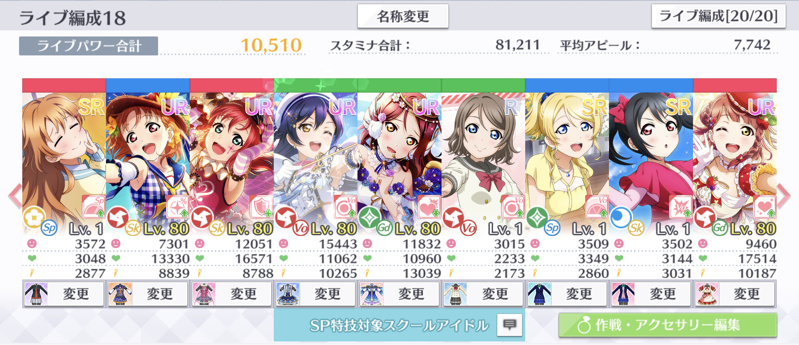

# 基本アピール増加/減少（AC）

基本アピール増加/減少（AC）は、特定のアピールチャンス時に発生する獲得ボルテージの増減効果です。

基本アピール増加/減少（AC）は、楽曲情報の「アピールチャンス情報」において「基本アピールを〜%増加/減少」と記載されているアピールチャンスの最中に発動します。


基本アピール増加/減少（AC）の効果で増減するのは、アピール値ではなくアピールによる獲得ボルテージです。よって、アピール値を参照する特技の効果量やSP特技の獲得ボルテージは、基本アピール増加/減少（AC）が発動しても変動しません。


## 基本アピール増加/減少（AC）による獲得ボルテージ補正の計算

基本アピール増加/減少（AC）により補正された獲得ボルテージは、次のルールで計算されます。

1. コンボによる補正を適用した獲得ボルテージに、基本アピール増加/減少（AC）による補正量を乗算する。
2. 1.にコンボによる補正を適用した獲得ボルテージを加算する。
3. 2.の計算結果の小数点以下を切り捨てて整数にする。

計算を数式で表すと、次のとおりとなります。

$$
v_{\text{acba}} = \left\lfloor \left(1+\frac{c_{\text{acba}}}{100}\right)v_{\text{co}}\right\rfloor
$$

ここで、数式内の変数の意味は次のとおりです。

$$
\begin{align}
  v_{\text{acba}}  &= \text{基本アピール増加/減少（AC）による補正を適用した獲得ボルテージ}\\
  c_{\text{acba}} &= \text{基本アピール増加/減少（AC）による補正量（%）}\\
  v_{\text{co}} &= \text{コンボによる補正を適用した獲得ボルテージ}
\end{align}
$$

## 計算の例

画像の編成内の梨子に基本アピール増加/減少（AC）を適用した場合の獲得ボルテージを計算します。

今回の例では、ゲストなしで「ユメノトビラ」上級をプレイし、後の「残スタミナ」の項までの補正を適用した獲得ボルテージを求めていきます。最終的な梨子の獲得ボルテージは、次の画像のとおり7694となります。

### ライブ基本アピール値の計算

この例はゲストなしなので、梨子のライブ基本アピール値は、編成画面のアピール値と同じ11832となります。

### ライブアピール値の計算

梨子のライブアピール値を計算します。この例では、梨子に次の効果が適用されました。

* ユメノトビラのノーツギミック（アピール減少 50%）

以上の効果を適用すると、梨子のライブアピール値は次のとおり5916となります。

$$
\begin{align}
a_{\text{lv}} & = \left\lfloor (1-0.5) \times 11832\right\rfloor\\
 &= 5916
\end{align}
$$

### クリティカル

ここから、獲得ボルテージを計算していきます。まずはクリティカルを適用した獲得ボルテージを計算します。この例で発動したクリティカル値を増加させる効果は次のとおりです。

* 彼方の個性2（基本クリティカル値増加 3%）
* 海未のひらめきスキル（基本クリティカル値増加 2%）

よって、梨子のクリティカル値は55%となり、クリティカル時の獲得ボルテージは次のとおり9169となります。

$$
\begin{align}
v_{\text{cr}} &= \lfloor 1.55\times 5916\rfloor\\
&= 9169
\end{align}
$$

### 判定

判定による補正を適用します。今回の例では判定がGREATだったので、獲得ボルテージが1.1倍され、10085となります。

$$
\begin{align}
v_{\text{ti}} &= \lfloor 1.1\times 9169\rfloor\\
&= 10085
\end{align}
$$

### コンボ

コンボによる補正を適用します。今回の例は85コンボ目なので、獲得ボルテージが1.05倍され、10589となります。

$$
\begin{align}
v_{\text{co}} &= \lfloor 1.05\times 10085\rfloor\\
&= 10589
\end{align}
$$

### 基本アピール増加/減少（AC）

基本アピール増加/減少（AC）の効果を適用します。今回の例では、アピールチャンス中に基本アピール減少50%が発動しているため、獲得ボルテージは次のとおり5294となります。

$$
\begin{align}
v_{\text{acba}} &= \left\lfloor \left(1+\frac{c_{\text{acba}}}{100}\right)v_{\text{co}}\right\rfloor\\
&= \lfloor(1-0.5)\times 10589\rfloor\\
&= 5294
\end{align}
$$


この計算結果とゲーム内の獲得ボルテージが等しくなることは「残スタミナ」の項で確認します。


