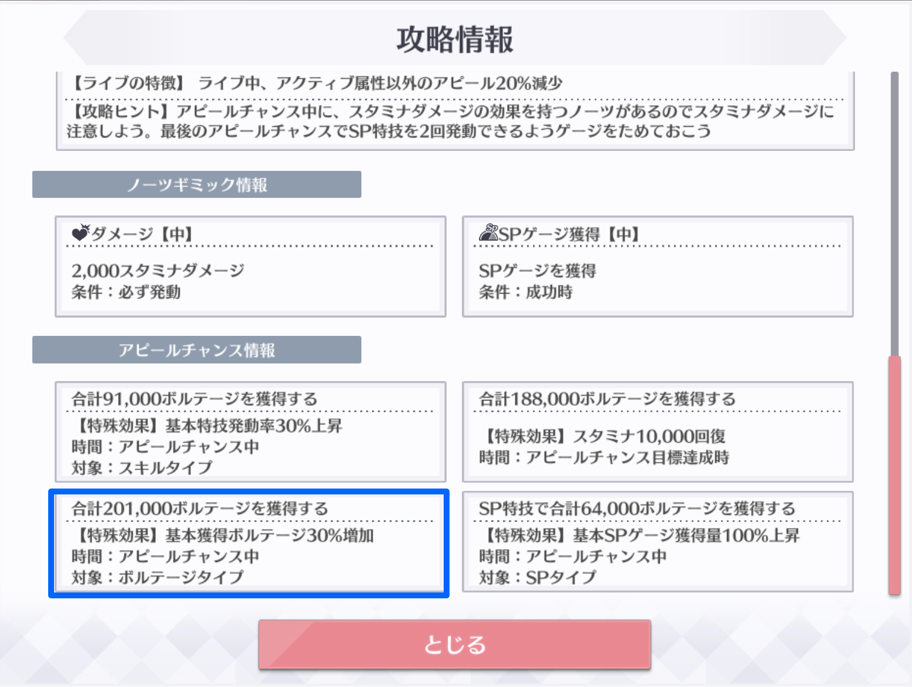
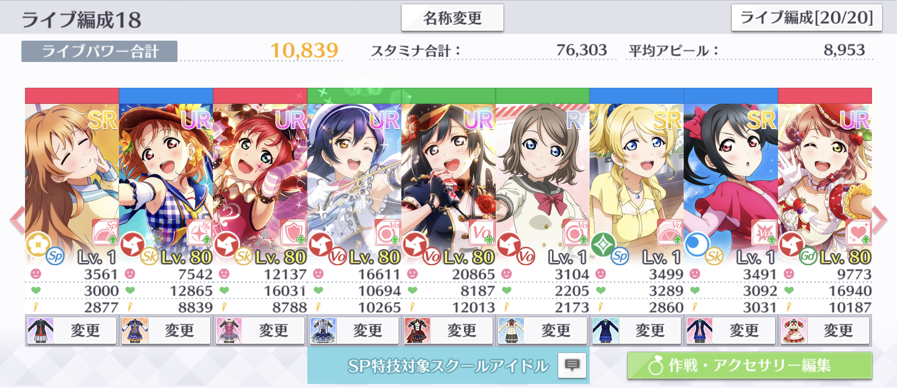

# 基本獲得ボルテージ増加/減少（AC）

基本獲得ボルテージ増加/減少（AC）は、特定のアピールチャンス時に発生する獲得ボルテージの増減効果です。

基本獲得ボルテージ増加/減少（AC）は、楽曲情報の「アピールチャンス情報」において「基本獲得ボルテージ〜%増加/減少」と記載されているアピールチャンスの最中に発動します。


基本獲得ボルテージ増加/減少（AC）の効果は、アピールによる獲得ボルテージに適用されます。SP特技や特技による獲得ボルテージには影響しません。


## 基本獲得ボルテージ増加/減少（AC）による獲得ボルテージ補正の計算


現在、基本獲得ボルテージ減少のアピールチャンスが存在しないため、減少効果の計算は推測で記載しています。


基本獲得ボルテージ増加/減少（AC）により補正された獲得ボルテージは、次のルールで計算されます。

1. スタミナによる補正を適用した獲得ボルテージに、基本獲得ボルテージ増加/減少（AC）による補正量を乗算する。
2. 1.をスタミナによる補正を適用した獲得ボルテージに加算する。
3. 2.の計算結果の小数点以下を切り捨てて整数にする。

計算を数式で表すと、次のとおりとなります。

$$
v_{\text{acvo}} = \left\lfloor \left(1+\frac{c_{\text{acvo}}}{100}\right)v_{\text{st}}\right\rfloor
$$

ここで、数式内の変数の意味は次のとおりです。

$$
\begin{align}
  v_{\text{acvo}}  &= \text{基本獲得ボルテージ増加/減少（AC）による補正を適用した獲得ボルテージ}\\
  c_{\text{acvo}} &= \text{基本獲得ボルテージ増加/減少（AC）による補正量（%）}\\
  v_{\text{st}} &= \text{スタミナによる補正を適用した獲得ボルテージ}
\end{align}
$$

## 計算の例

画像の編成内のせつ菜に基本獲得ボルテージ増加/減少（AC）を適用した場合の獲得ボルテージを計算します。

この例では、ゲストなしで「僕らは今の中で」上級をプレイします。最終的な計算結果は、次の画像のとおり31747となるはずです。

### ライブ基本アピール値の計算

この例はゲストなしなので、せつ菜のライブ基本アピール値は、編成画面のアピール値と同じ20865となります。

### ライブアピール値の計算

ライブアピール値を計算します。この例では、せつ菜に次の効果が適用されました。

* 海未の個性2（基本アピール増加 5%）

以上の効果を適用すると、せつ菜のライブアピール値は次のとおり21908となります。

$$
\begin{align}
a_{\text{lv}} & = \left\lfloor (1+0.05) \times 20865\right\rfloor\\
 &= 21908
\end{align}
$$

### クリティカル

クリティカル補正を適用します。今回の例ではクリティカルが出なかったので、ライブアピール値がそのまま獲得ボルテージになります。

$$
\begin{align}
v_{\text{cr}} &= \lfloor 1\times 21908\rfloor\\
&= 21908
\end{align}
$$

### 判定

判定による補正を適用します。今回の例ではWONDERFULだったので、獲得ボルテージが1.2倍され、26289となります。

$$
\begin{align}
v_{\text{ti}} &= \lfloor 1.2\times 21908\rfloor\\
&= 26289
\end{align}
$$

### コンボ

コンボによる補正を適用します。今回の例は37コンボ目なので、獲得ボルテージが1.02倍され、26814となります。

$$
\begin{align}
v_{\text{co}} &= \lfloor 1.02\times 26289\rfloor\\
&= 26814
\end{align}
$$

### 基本アピール増加/減少（AC）・スペシャルタイム・獲得ボルテージ増加

今回の例では、基本アピール増加/減少（AC）、スペシャルタイム及び獲得ボルテージ増加の効果が発動していないので、コンボ補正を適用したボルテージがそのまま獲得ボルテージになります。

$$
\begin{align}
v_{\text{vo}} &=  \lfloor1\times 26814\rfloor\\
&= 26814
\end{align}
$$

### アピールチャンス

今回の例はアピールチャンス中なので、獲得ボルテージが1.1倍され、29495となります。

$$
\begin{align}
v_{\text{ac}} &=  \lfloor1.1\times 26814\rfloor\\
&= 29495
\end{align}
$$

### 作戦効果（Vo）

せつ菜がいる作戦の作戦効果（Vo）は+15%のため、獲得ボルテージは次のとおり33919となります。

$$
\begin{align}
v_{\text{ac}} &=  \lfloor1.15\times 29495\rfloor\\
&= 33919
\end{align}
$$

### 属性一致

せつ菜の属性が楽曲と一致しているため、獲得ボルテージが1.2倍され、40702となります。

$$
\begin{align}
v_{\text{at}} &=  \lfloor1.2\times 33919\rfloor\\
&= 40702
\end{align}
$$

### 残スタミナ

この例では、スタミナゲージが赤色のため、獲得ボルテージが0.6倍され、24421となります。

$$
\begin{align}
v_{\text{st}} &=  \lfloor0.6\times 40702\rfloor\\
&= 24421
\end{align}
$$

### 基本獲得ボルテージ増加/減少（AC）

最後に、基本獲得ボルテージ増加/減少（AC）の効果を適用します。今回の例で発動しているアピールチャンスの効果は次のとおりです。

* 基本獲得ボルテージ30%増加

よって、基本獲得ボルテージ増加/減少（AC）の効果を適用した獲得ボルテージは、次のとおり31747となります。

$$
\begin{align}
v_{\text{acvo}} &= \left\lfloor \left(1+\frac{c_{\text{acvo}}}{100}\right)v_{\text{st}}\right\rfloor\\
&= \lfloor(1+0.3)\times 24421\\
&= 31747
\end{align}
$$

せつ菜がアピールしたときの獲得ボルテージが、計算結果と一致しました。

