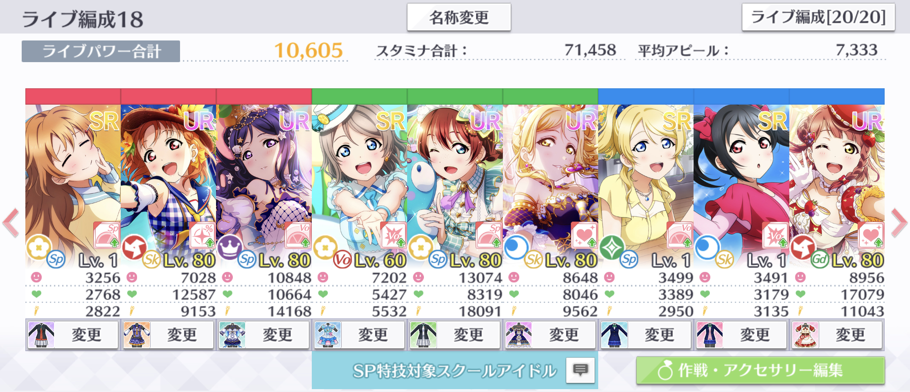

# コンボ

コンボ数によって、次のとおり獲得ボルテージに補正がかかります。

| コンボ数 | 獲得ボルテージ補正 |
| :--- | :--- |
| 0〜10 | 1.0倍 |
| 11〜30 | 1.01倍 |
| 31〜50 | 1.02倍 |
| 51〜70 | 1.03倍 |
| 71〜 | 1.05倍 |

## コンボによる獲得ボルテージ補正の計算

コンボにより補正された獲得ボルテージは、次のルールで計算されます。

1. 判定による補正を適用した獲得ボルテージに、コンボによる補正量を乗算する。
2. 1.の計算結果の小数点以下を切り捨てて整数にする。

計算を数式で表すと、次のとおりとなります。

$$
v_{\text{co}} = \lfloor c_{\text{co}}v_{\text{ti}}\rfloor
$$

$$
c_{\text{co}} = 
\begin{cases}
  1 & (0 \leq n_{\text{co}} \leq 10)\\
  1.01 & (10 < n_{\text{co}} \leq 30)\\
  1.02 & (30 < n_{\text{co}} \leq 50)\\
  1.03 & (50 < n_{\text{co}} \leq 70)\\
  1.05 & (n_{\text{co}} > 70)\\
\end{cases}
$$

ここで、数式内の変数の意味は次のとおりです。

$$
\begin{align}
  v_{\text{co}}  &= \text{コンボによる補正を適用した獲得ボルテージ}\\
  c_{\text{ti}} &= \text{コンボによる補正量}\\
  v_{\text{ti}} &= \text{判定による補正を適用した獲得ボルテージ}\\
  n_{\text{co}} &= \text{コンボ数}
\end{align}
$$

## 計算の例

前項の例を引き続き使用して、170コンボ目の獲得ボルテージを計算します。

この編成の曜が「嵐の中の恋だから」上級でクリティカルを出した際の判定がWONDERFULだった場合、獲得ボルテージは12972でした。このときが170コンボ目だった場合、コンボによる補正量は1.05となるため、次のとおり獲得ボルテージは13620となります。

$$
\begin{align}
v_{\text{co}} &= \lfloor c_{\text{co}}v_{\text{ti}}\rfloor\\
&=\lfloor 1.05 \times 12972 \rfloor\\
&= 13620
\end{align}
$$

曜がアピールしたときの獲得ボルテージが、計算結果と一致しました。


今回の例では、クリティカルからコンボまでを適用した獲得ボルテージが最終獲得ボルテージとなるように、後の計算要素を全て排除しています。


