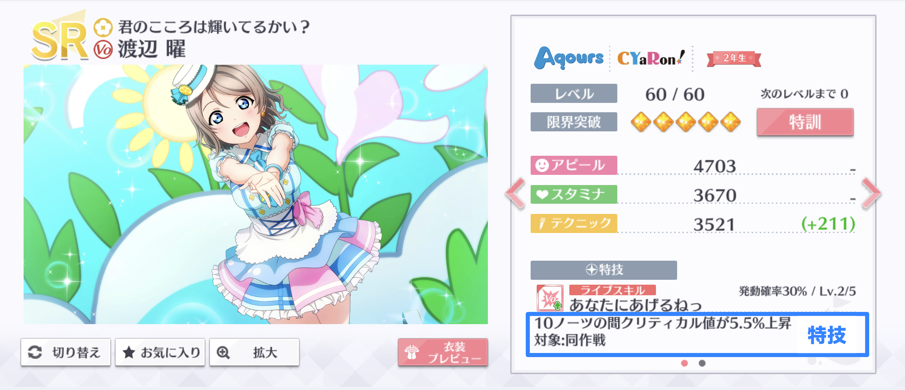
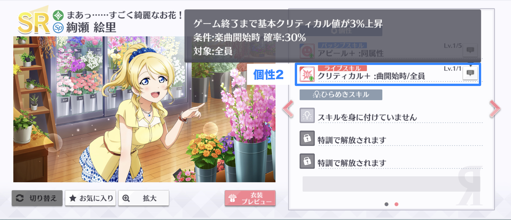
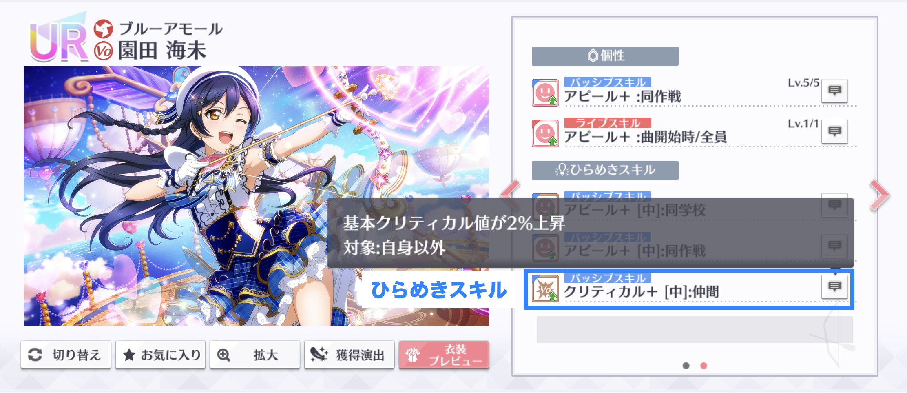
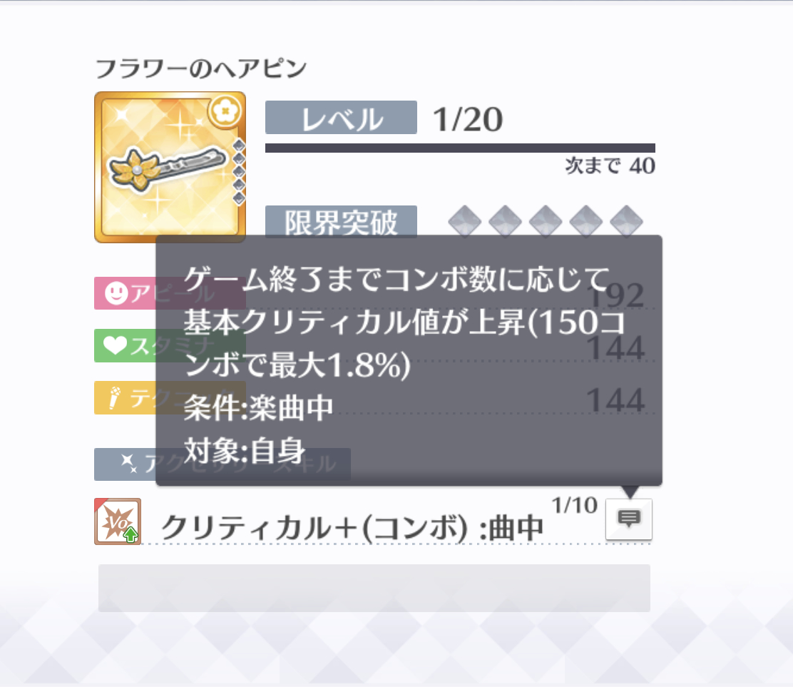
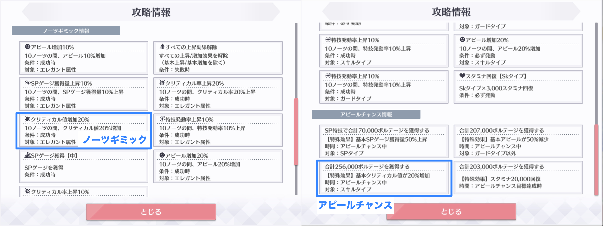
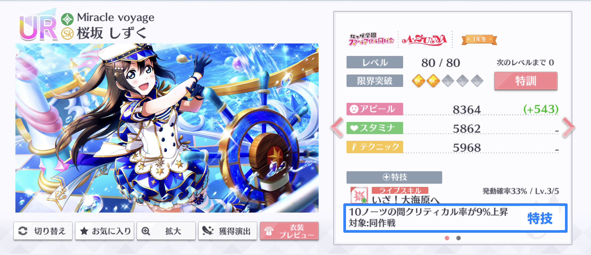
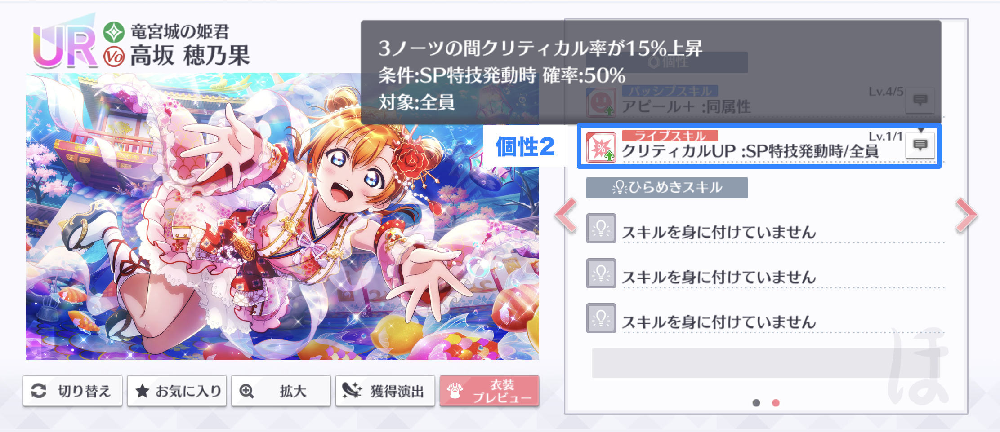
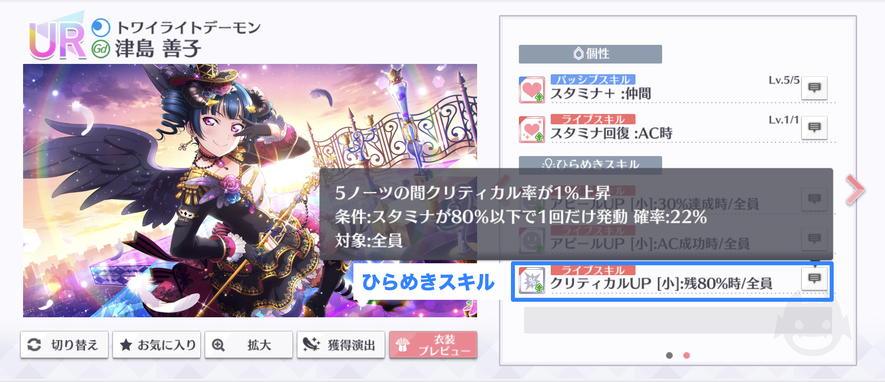
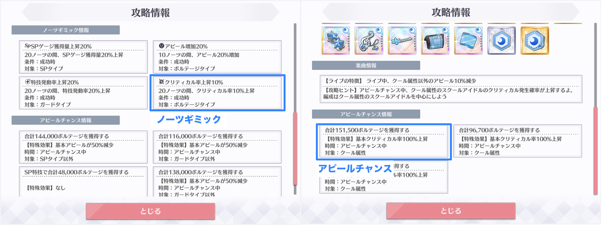
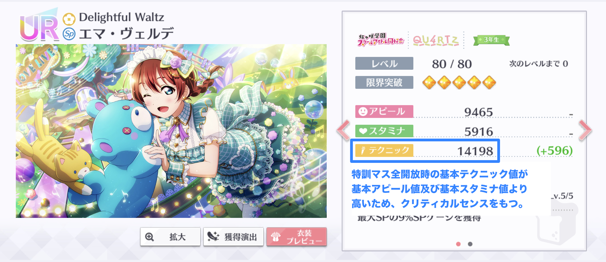

# クリティカル

クリティカルは、アピール時に一定確率で発生するボーナスです。クリティカル発生時に獲得できるボルテージは、クリティカル値によって決定されます。

## クリティカル値

クリティカル値は、クリティカルによる獲得ボルテージの増加量を決定するパラメータです。デフォルトのクリティカル値は50%となっており、クリティカルが発生した場合、ライブアピール値の50%だけ獲得ボルテージが増加します。

クリティカル値は、次の効果により上昇させることができます。

* 特技・個性2・ひらめきスキル
* ヘアピンのアクセサリースキル
* ノーツギミック・アピールチャンス


クリティカル値を上昇させる効果には、対象が「基本クリティカル値」であるものと「クリティカル値」であるものが存在しますが、両者に効果の差異はなく、計算上同じものとして扱われます。異なるのは効果時間であり、基本クリティカル値系はライブ終了まで、クリティカル値系は「〜ノーツ間」等の決まった時間内でそれぞれ発動します。


### 特技・個性2・ひらめきスキル

スクールアイドルがもつ特技、個性2及びひらめきスキルにより、クリティカル値を上昇させることができます。

### ヘアピンのアクセサリースキル

ヘアピンのアクセサリースキルは、クリティカル値を上昇させます。

### ノーツギミック・アピールチャンス

ノーツギミック及びアピールチャンスの効果には、クリティカル値を上昇させるものがあります。

## クリティカルによる獲得ボルテージ増加の計算

クリティカル発生時の獲得ボルテージは、次のルールで計算されます。

1. 同一スクールアイドルを対象とするクリティカル値上昇及び基本クリティカル値上昇の効果量を合計する。
2. 1.で求めたクリティカル値上昇及び基本クリティカル値上昇の合計効果量を、デフォルトのクリティカル値（50%）に加算する。
3. 2.で求めたクリティカル値をライブアピール値に乗算する。
4. 3.をライブアピール値に加算する。
5. 4.の計算結果の小数点以下を切り捨てて整数にする。

クリティカルが発生しなかった場合は、ライブアピール値がそのまま獲得ボルテージとなります。

計算を数式で表すと、次のとおりとなります。

$$
v_{\text{cr}} = \begin{cases}
\left\lfloor \left( 1.50+{\displaystyle \sum_{x \in \mathbb{X}_{\text{cr}}} \frac{x}{100}} \right) a_{\text{lv}}\right\rfloor & (\text{クリティカル時})\\
a_{\text{lv}} & (\text{非クリティカル時})
\end{cases}
$$

ここで、数式内の変数及び記号の意味はそれぞれ次のとおりです。

$$
\begin{align}
  v_{\text{cr}} & = \text{クリティカルを適用した獲得ボルテージ} \\
  a_{\text{lv}} & = \text{ライブアピール値}\\
  \mathbb{X}_{\text{cr}} & = \text{適用されるクリティカル値上昇及び基本クリティカル値上昇の効果量（%表示）の集合}\\
  \lfloor\cdot\rfloor & = \text{小数点以下の切り捨て}
\end{align}
$$

## ヘアピンのアクセサリースキルの効果量

ヘアピンのアクセサリースキルの効果量は、ライブ中のコンボ数及びスキルレベルにより変動します。これにより、ライブ中に発動しているヘアピンのスキル効果量は、ゲーム内の画面から確認することが困難となっています。

### コンボ数に応じた効果量の変動

アクセサリー情報画面から見られるヘアピンのアクセサリースキルの効果量は、コンボ数が151のときの効果量です。ヘアピンのライブスキルの効果量は、コンボなしの時点では0%であり、コンボ数が1増えるごとに、均等に効果量が上昇していきます。最終的に、コンボ数151で効果量が最大値となります。


ヘアピンの効果量は「150コンボで最大〜%」と記載されていますが、これは「150コンボを達成すると最大になる」という意味です。つまり、最大の効果量が適用されるのは、150コンボを達成した後の151コンボ目からとなります。


### アクセサリーレベルに応じた効果量の変動

「基本アピール増加/減少」の項に記載したブローチの仕様と同等と推測されます。



## クリティカル率


本項の記載内容は色々な方により検証されていますが、確率論のため、正確性の保証はできません。


クリティカル率は、クリティカルの発生確率です。クリティカル率は、スクールアイドルごとに次の要素から決定されます。

* ライブテクニック値
* 属性一致
* 特技・個性2・ひらめきスキル・楽曲効果・ノーツギミック・アピールチャンス
* クリティカルセンス

### ライブテクニック値

ライブ中のテクニック値（ライブテクニック値）がクリティカル率の算出に使用されます。クリティカル率は、ライブテクニック値から次のとおり計算されます**［推測］**。

$$
r_{\text{cr}} = 0.003t_{\text{lv}}(\text)
$$

ここで、数式内の変数の意味は次のとおりです。

$$
c_{\text{cr}} = 
\begin{cases}
  1.2 & (\text{属性一致時})\\
  1 & (\text{属性不一致時})
\end{cases}
$$

### 特技・個性2・ひらめきスキル・楽曲効果・ノーツギミック・アピールチャンス

クリティカル率は、特技、個性2、ひらめきスキル、ノーツギミック及びアピールチャンスの効果により上昇/低下します。


クリティカル率を上昇/低下させる効果には、対象が「基本クリティカル率」であるものと「クリティカル率」であるものが存在しますが、両者に効果の差異はなく、計算上同じものとして扱われます**［推測］**。異なるのは効果時間であり、基本クリティカル率系はライブ終了まで、クリティカル率系は「〜ノーツ間」等の決まった時間内でそれぞれ発動します。


クリティカル率を上昇/低下させる効果により、クリティカル率は次のルールで増減します。

1. 同一スクールアイドルを対象とする基本クリティカル率上昇/低下及びクリティカル率上昇/低下の効果量を合計する。
2. 1.で求めた基本クリティカル率上昇/低下及びクリティカル率上昇/低下の合計効果量を、クリティカル率に加算する。

計算を数式で表すと、次のとおりとなります。

$$
r_{\text{cr}} = 0.003\left\lfloor c_{\text{cr}}t_{\text{lv}}\right\rfloor + \sum_{u \in \mathbb{U}_{\text{cr}}}u \text{ (%)}
$$

ここで、数式内の変数及び記号の意味はそれぞれ次のとおりです。

$$
\begin{align}
  \mathbb{U}_{\text{cr}} & = \text{適用されるクリティカル率上昇/低下の効果量（%表示）の集合}
\end{align}
$$

### クリティカルセンス

一部のスクールアイドルは、通常よりも高いクリティカル率を発揮できる隠し能力「クリティカルセンス」をもちます。クリティカルセンスをもつスクールアイドルは、クリティカル率に15%**［推測］**のボーナスが加算されます。


クリティカルセンスのボーナス量は検証中です。ですが、15%付近であることはほぼ確定と思われます。


クリティカルセンスの有無は、特訓マスを全て開放した状態の基本ステータスで判断できます。特訓マス全開放時の基本テクニック値が、基本アピール値及び基本スタミナ値より高いスクールアイドルは、クリティカルセンスをもちます**［推測］**。


特訓マスを全て開放した状態の基本ステータスは、ホーム画面の「エピソード」からスクールアイドルを選択し、「スクールアイドル」を開くことで確認できます。



基本テクニック値が基本アピール値又は基本スタミナ値と等しいスクールアイドルは、クリティカルセンスがありません。



クリティカルセンスの有無が変化することはありません。クリティカルセンスの有無は、あくまで特訓マス全開放時のステータスで決定されます。例えば、クリティカルセンスがないスクールアイドルについて、ステータスの中でテクニック値が最大になるように特訓マスを開放したとしても、クリティカルセンスは付与されません。


クリティカルセンスを考慮したクリティカル率を数式で表すと、次のとおりとなります。

$$
r_{\text{cr}} = 
\begin{cases}
{\displaystyle 0.003\left\lfloor c_{\text{cr}}t_{\text{lv}}\right\rfloor + \sum_{u \in \mathbb{U}_{\text{cr}}}u + 15\text{ (%)}} &(\text{クリティカルセンス有})\\
{\displaystyle 0.003\left\lfloor c_{\text{cr}}t_{\text{lv}}\right\rfloor + \sum_{u \in \mathbb{U}_{\text{cr}}}u\text{ (%)}} &(\text{クリティカルセンス無})
\end{cases}
$$

## 計算の例

画像の編成内の曜がクリティカルを出した場合の獲得ボルテージを計算します。

今回の例では、ゲストなしで「嵐の中の恋だから」上級をプレイし、後の「コンボ」の項までの補正を適用した獲得ボルテージを求めていきます。最終的な曜の獲得ボルテージは、次の画像のとおり13620となります。

### ライブ基本アピール値の計算

今回の例はゲストなしなので、曜のライブ基本アピール値は、編成画面のアピール値と同じ7202となります。

### ライブアピール値の計算

ライブアピール値を計算します。今回の例では「嵐の中の恋だから」上級の楽曲効果で全員のアピールが10%減少するため、曜のライブアピール値は次のとおり6481となります。

$$
\begin{align}
a_{\text{lv}} & = \lfloor (1-0.1)\times 7202 \rfloor\\
 &= 6481
\end{align}
$$

### クリティカル

クリティカルを適用した獲得ボルテージを計算します。この例で発動したクリティカル値を増加させる効果は次のとおりです。

* 曜のひらめきスキル（基本クリティカル値増加 1%）
* 彼方の個性2（基本クリティカル値増加 3%）
* 曜の特技（クリティカル値増加 5.5%）2回分
* ヘアピンのアクセサリースキル（基本クリティカル値増加 1.8%）

全ての効果を合計し、デフォルトのクリティカル値（50%）に加算すると、曜のクリティカル値は66.8%となり、獲得ボルテージはライブアピール値の1.668倍となります。

$$
\begin{align}
\left( 1.50+\sum_{x \in \mathbb{X}_{\text{cr}}} \frac{x}{100}\right) &= \left( 1.50+ \frac{1+3+5.5+5.5+1.8}{100} \right) \\
& = 1.668
\end{align}
$$

以上より、曜がクリティカルを出した場合の獲得ボルテージは次のとおり10810となります。

$$
\begin{align}
v_{\text{cr}} &= \left\lfloor \left( 1.50+{\displaystyle \sum_{x \in \mathbb{X}_{\text{cr}}} \frac{x}{100}} \right) a_{\text{lv}}\right\rfloor\\
& = \lfloor 1.668\times 6481\rfloor\\
&= 10810
\end{align}
$$


この計算結果とゲーム内の獲得ボルテージが等しくなることは「コンボ」の項で確認します。


