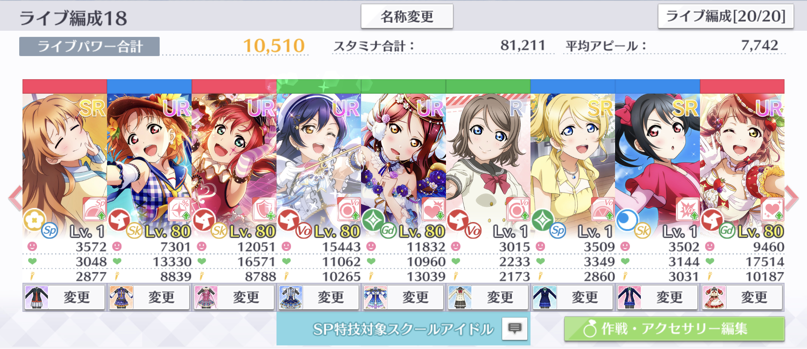

# スペシャルタイム

スペシャルタイムは、SP特技の発動から一定秒数間続くボーナスタイムです。スペシャルタイム中は、アピールによる獲得ボルテージが1.1倍になります。


スペシャルタイム中は、アピールによる獲得ボルテージだけでなく、特技効果も1.1倍になります。類似効果にアピールチャンスがありますが、あちらは獲得ボルテージのみ1.1倍となるため、特技効果量の観点では、スペシャルタイムの方が強力です。一方で、スペシャルタイムはアピールチャンスと異なり、SP特技の獲得ボルテージを1.1倍することはできません。


## スペシャルタイムによる獲得ボルテージ補正の計算

スペシャルタイムの効果により補正された獲得ボルテージは、次のルールで計算されます。

1. 基本アピール増加/減少（AC）による補正を適用した獲得ボルテージに、スペシャルタイムによる補正量を乗算する。
2. 1.の計算結果の小数点以下を切り捨てて整数にする。

計算を数式で表すと、次のとおりとなります。

$$
v_{\text{st}} = \begin{cases}
\lfloor 1.1v_{\text{acba}}\rfloor &（スペシャルタイム時）\\
v_{\text{acba}} &（非スペシャルタイム時）
\end{cases}
$$

ここで、数式内の変数の意味は次のとおりです。

$$
\begin{align}
  v_{\text{st}}  &= \text{スペシャルタイムによる補正を適用した獲得ボルテージ}\\
  v_{\text{acba}}  &= \text{基本アピール増加/減少（AC）による補正を適用した獲得ボルテージ}\\
\end{align}
$$

## 計算の例

前項の例を引き続き使用して、スペシャルタイム時の獲得ボルテージを計算します。

この編成の梨子が、「ユメノトビラ」上級で基本アピール増加/減少（AC）の効果を受けたときの獲得ボルテージは5294でした。よって、このときスペシャルタイム中であれば、獲得ボルテージが1.1倍され、次のとおり5823となります。

$$
\begin{align}
v_{\text{st}} &= \lfloor 1.1v_{\text{acba}}\rfloor\\
&=\lfloor 1.1 \times 5294 \rfloor\\
&= 5823
\end{align}
$$


この計算結果とゲーム内の獲得ボルテージが等しくなることは「残スタミナ」の項で確認します。


