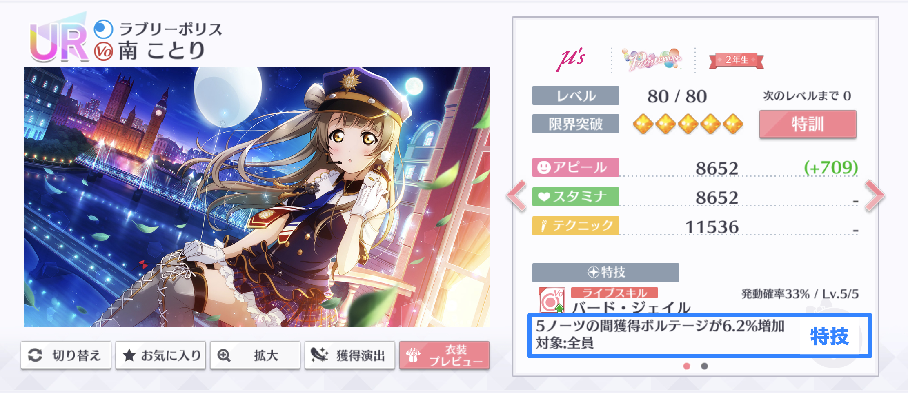
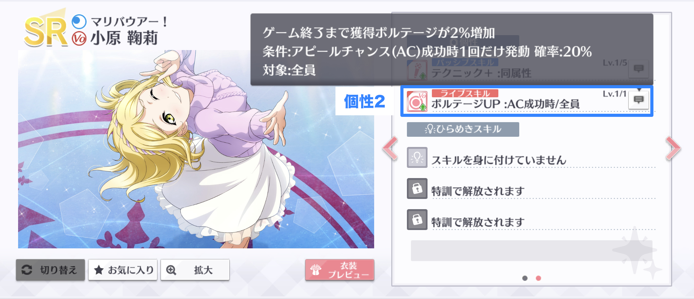
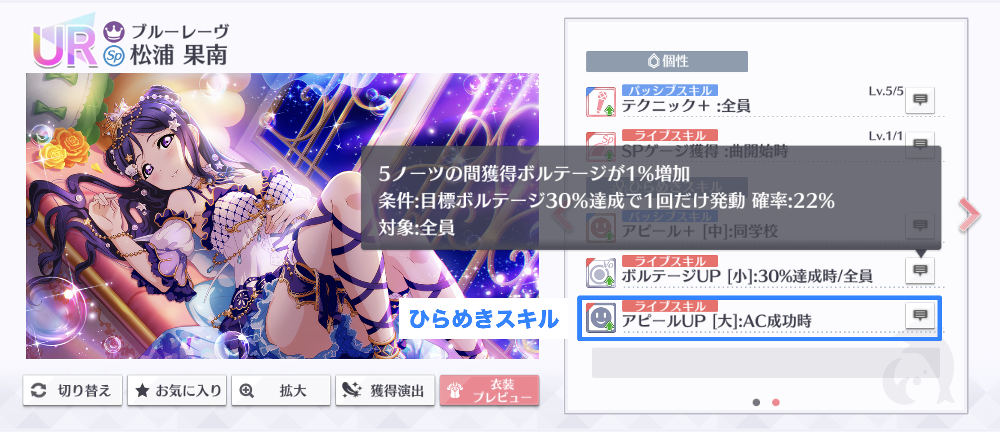
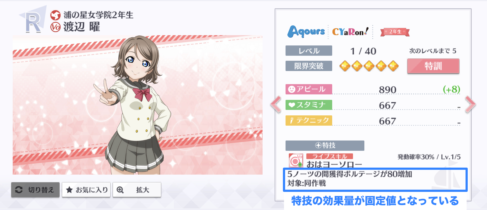

# 獲得ボルテージ増加

ライブスキルにより、獲得ボルテージを増加できます。獲得ボルテージ増加のライブスキルには次の種類があります。

* 特技
* 個性2
* ひらめきスキル


獲得ボルテージ増加のライブスキルは、アピールによる獲得ボルテージに適用されます。SP特技や特技による獲得ボルテージには影響しません。


## 獲得ボルテージ増加（固定値）

獲得ボルテージ増加の多くは、効果量の割合（%）だけ、アピールの獲得ボルテージを増加させます。しかし、一部のスクールアイドルがもつ獲得ボルテージ増加の特技は、決まった数値分だけアピールの獲得ボルテージを増加させる効果（獲得ボルテージ増加（固定値））となっており、区別が必要です。獲得ボルテージ増加（固定値）は、その効果量を獲得ボルテージ増加の効果を適用した獲得ボルテージに加算することで計算します。

## 獲得ボルテージ増加による獲得ボルテージ補正の計算

獲得ボルテージ増加のライブスキルによって増加した獲得ボルテージは、次のルールで計算されます。

1. 同一スクールアイドルを対象とする獲得ボルテージ増加の効果量を合計する。
2. 1.で求めた獲得ボルテージ増加の合計効果量をスペシャルタイムの補正を適用した獲得ボルテージに乗算する。
3. 2.をスペシャルタイムの補正を適用した獲得ボルテージに加算する。
4. 3.の計算結果に、獲得ボルテージ増加（固定値）の効果量を加算する。
5. 4.の計算結果の小数点以下を切り捨てて整数にする。

計算を数式で表すと、次のとおりとなります。

$$
v_{\text{vo}} = \left\lfloor \left( 1+\sum_{x \in \mathbb{X}_{\text{vo}}} \frac{x}{100} \right) v_{\text{st}} + \sum_{x \in \mathbb{X}_{\text{voc}}}x\right\rfloor
$$

ここで、数式内の変数及び記号の意味はそれぞれ次のとおりです。

$$
\begin{align}
  v_{\text{vo}} & = \text{獲得ボルテージ増加を適用した獲得ボルテージ} \\
  v_{\text{st}} & = \text{スペシャルタイムによる補正を適用した獲得ボルテージ}\\
  \mathbb{X}_{\text{vo}} & = \text{適用される獲得ボルテージ増加の効果量（%表示）の集合}\\
  \mathbb{X}_{\text{voc}} & = \text{適用される獲得ボルテージ増加（固定値）の効果量の集合}\\
  \lfloor\cdot\rfloor & = \text{小数点以下の切り捨て}
\end{align}
$$

## 計算の例

前項の例を引き続き使用して、獲得ボルテージ増加の効果を適用した獲得ボルテージを計算します。

この編成の梨子は、「ユメノトビラ」上級でスペシャルタイム中の獲得ボルテージが5823でした。ここに、獲得ボルテージ増加の効果を適用します。この例で発動した獲得ボルテージ増加は次のとおりです。

* 海未の特技（獲得ボルテージ増加 6.2%）2回分
* 曜の特技（獲得ボルテージ増加（固定値） 80）

よって、獲得ボルテージ増加の効果を適用した梨子の獲得ボルテージは、次のとおり6625となります。

$$
\begin{align}
v_{\text{vo}} &= \left\lfloor \left( 1+\sum_{x \in \mathbb{X}_{\text{vo}}} \frac{x}{100} \right) v_{\text{st}} + \sum_{x \in \mathbb{X}_{\text{voc}}}x\right\rfloor\\
&= \left\lfloor\left( 1+ \frac{6.2+6.2}{100} \right) \times 5823 + 80\right\rfloor\\
& = 6625
\end{align}
$$


この計算結果とゲーム内の獲得ボルテージが等しくなることは「残スタミナ」の項で確認します。


